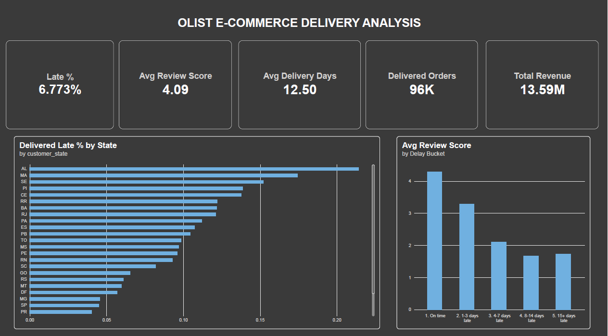
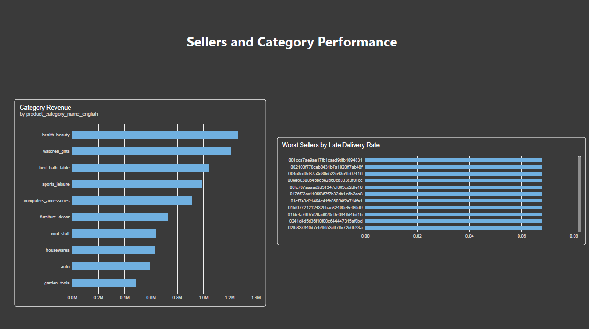

# Olist E-Commerce Delivery Analysis

Analyzing how late deliveries affect customer satisfaction across ~100K Brazilian e-commerce orders, and identifying where delivery performance breaks down by region and seller.

## Business Question

Do late deliveries hurt customer satisfaction, and where and why do they happen?

## Dataset

[Brazilian E-Commerce Public Dataset by Olist](https://www.kaggle.com/datasets/olistbr/brazilian-ecommerce) — ~99,441 orders placed between 2016 and 2018, across 9 relational tables (orders, order items, products, sellers, customers, reviews, and payments).

## Tools

- **MySQL 8** — data loading, relational modeling, and exploratory analysis (joins, CTEs, window functions)
- **Python** (pandas, seaborn, scipy) — data validation, visualization, and statistical testing
- **Power BI** — interactive dashboard for delivery and sales performance

## Approach

1. Loaded all 9 raw CSVs into MySQL and built a `delivered_orders` view flagging each order as on-time or late
2. Answered a series of business questions in SQL: delivery timing, review score impact, state-level and seller-level performance, category revenue, and monthly trends
3. Re-validated the core findings in Python, added visualizations, and ran a statistical significance test on the review-score gap
4. Built a two-page Power BI dashboard combining KPIs, delivery performance, and sales breakdowns

## Key Findings

**Late deliveries are a clear driver of dissatisfaction.**
6.77% of the 96,470 delivered orders analyzed arrived after the estimated delivery date. Late orders averaged **2.27 stars**, compared to **4.29 stars** for on-time orders — a gap confirmed as statistically significant with a Mann-Whitney U test (p < 0.001), not due to chance.

**Even a short delay costs a full star.** Ratings drop sharply and then level off:

| Delay | Orders | Avg. Review |
|---|---|---|
| On time | 89,443 | 4.29 |
| 1–3 days late | 1,852 | 3.29 |
| 4–7 days late | 1,748 | 2.11 |
| 8–14 days late | 1,446 | 1.67 |
| 15+ days late | 1,335 | 1.73 |

**Late rates vary sharply by region**, from about 3% to over 21%. The Northeast is consistently worst — Alagoas (AL, 21.4%), Maranhão (MA, 17.4%), and Sergipe (SE, 15.2%) — while São Paulo (SP), the platform's largest market by far (40,494 orders), performs best among high-volume states at 4.5% late and the fastest average delivery (8.3 days).

**Long delivery time alone doesn't explain late orders — the size of the buffer does.** Amazonas (AM) has one of the longest average delivery times (26.4 days) but only a 2.8% late rate, because its promised delivery window leaves a wide ~19.5-day buffer. Alagoas, by contrast, has a similar delivery time (24.5 days) but only an ~8.7-day buffer, and a 21.4% late rate. States with tighter buffers between the promised and actual delivery date consistently show higher late rates.

**A small group of sellers drives outsized delay.** Several sellers (with 30+ orders each, so not due to small sample size) show late rates of 20–33%, three to five times the platform average, spread across multiple states (SP, PR, MG, SC) — suggesting seller-level operational issues rather than a purely regional problem.

**Health & beauty and watches/gifts lead product revenue**, for different reasons: health & beauty wins on order volume (8,836 orders), while watches & gifts has the highest average item price in the top 5 (R$201.14) despite fewer orders.

**Order volume grew steadily** from ~787 orders/month in January 2017 to a peak of ~7,187/month by January 2018, then leveled off. (Data before October 2016 and after August 2018 was excluded as incomplete — platform ramp-up and dataset cutoff, respectively.)

## Recommendations

- **Review estimated delivery windows in the Northeast**, particularly Alagoas, Maranhão, and Sergipe, where thin buffers between promised and actual delivery are linked to the highest late rates.
- **Audit the worst-performing sellers directly**, rather than only addressing delivery by region — several sellers have late rates several times the platform average regardless of location.
- **Prioritize fixes in high-volume states first.** São Paulo and Rio de Janeiro, despite not having the worst late *rates*, contribute the largest raw number of late orders due to their order volume.

## Dashboard

Two-page Power BI dashboard:
- **Overview** — 5 KPI cards (late %, avg. review score, avg. delivery days, delivered orders, total revenue) plus late-rate-by-state and review-score-by-delay-bucket charts
- **Sellers & Categories** — top 10 revenue categories and the 10 worst-performing sellers by late delivery rate




## Repository Structure

```
├── data/          data download instructions (raw CSVs not included, see data/README.md)
├── sql/           all SQL queries, in order of analysis
├── notebooks/     Python analysis (charts + statistical test)
├── dashboard/     Power BI (.pbix) file
├── images/        exported charts and dashboard screenshots
└── scripts/       MySQL data loader script
```

## How to Reproduce

1. Download the dataset from Kaggle (see `data/README.md`) and place the CSVs in `/data`
2. Create a MySQL database: `CREATE DATABASE olist CHARACTER SET utf8mb4;`
3. Set the `MYSQL_PASSWORD` environment variable and run `scripts/load_data.py`
4. Run the SQL files in `sql/` in order to build the view and reproduce the analysis
5. Open `notebooks/olist_analysis.ipynb` to reproduce the Python charts and statistical test
6. Open `dashboard/olist_dashboard.pbix` in Power BI Desktop to view the dashboard